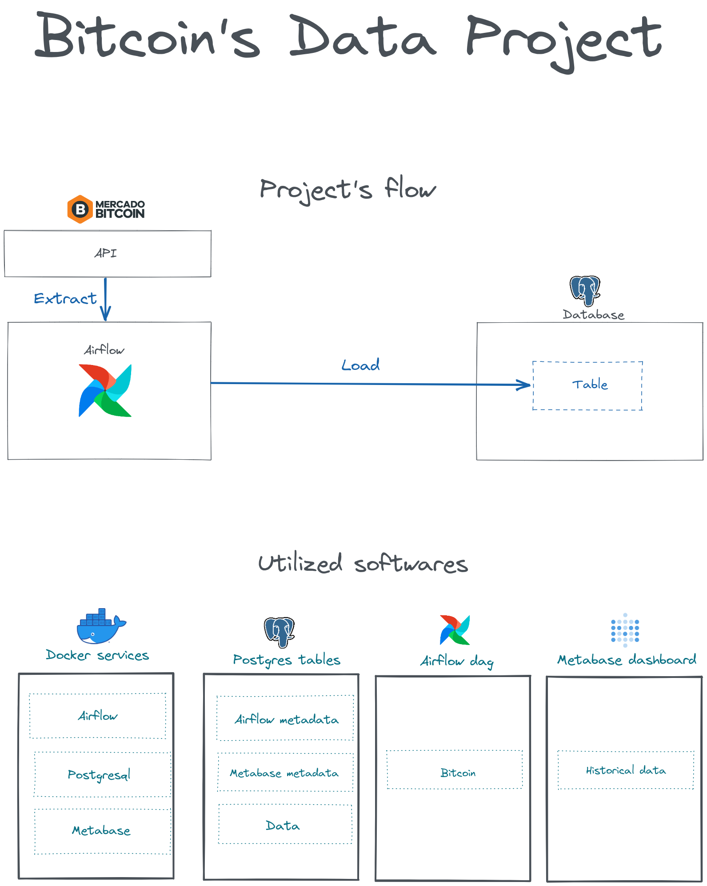

# ELT Bitcoin's data

## Goal
 The purpose of this project is to extract bitcoin's data from Mercado Bitcoin's API and save it in a relational database.

## Mercado Bitcoin
[Mercado Bitcoin](https://www.mercadobitcoin.com.br/) is a brazilian company for trading cryptocurrencies. It makes available data from coins, but in this specific project we're dealing ***only*** with Bitcoin.

## API

API's full documentations is available [here](https://www.mercadobitcoin.com.br/api-doc/). On the project we work with the "day summary" method, fetching historical data.

## Technologies used
For data visualization it's utilized Metabase, as SGDB it's used Postgres and finally for the ELT process the software chose was Apache Airflow. All services are in the same docker-compose file, they are meant to run together.

# Architecture
The image below explains how the project was designed.

